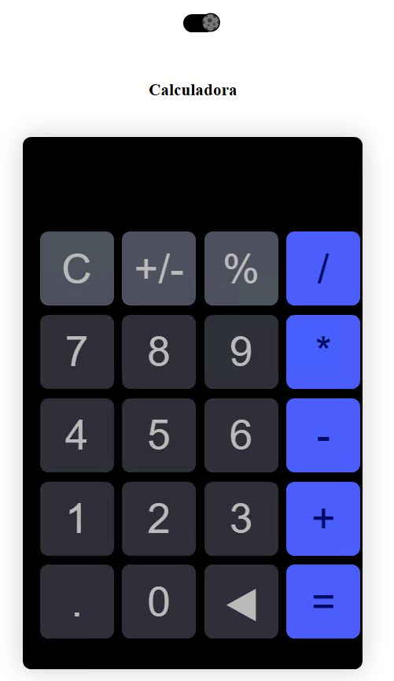
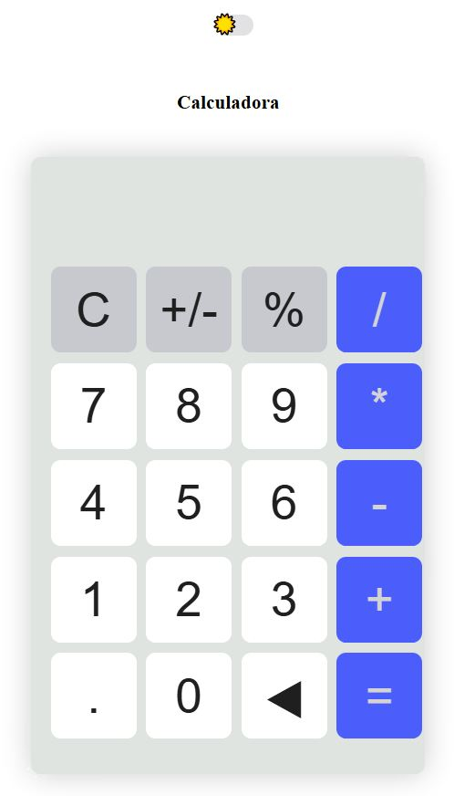

# React + Vite
## Calculadora con Tema Oscuro y Claro

Esta es una calculadora básica creada con React y styled-components, que muestra mis habilidades como desarrollador full-stack.

## Demo

### Modo Oscuro


### Modo Claro


También puede consultar la demostración en vivo. [Aqui](https://palaciosf416.github.io/calculadora/).

## Características

- Modo oscuro y claro disponible.
- Datos comprimidos y cargados de forma diferida.
- Compatible con todos los dispositivos móviles, con una interfaz de usuario agradable y atractiva.

## Instalación

1. Clonar el repositorio:

    ```bash
    git clone <reponame>
    ```

2. Instalar las dependencias:

    ```bash
    npm install
    ```

3. Iniciar el servidor:

    ```bash
    npm run dev
    ```

## Stack Tecnológico

**Cliente:** React, Vite, styled-components, useContext, useState

## Soporte

Si encuentras útil este proyecto o te gustaría apoyar mi trabajo, puedes darle una ⭐ a este repositorio.